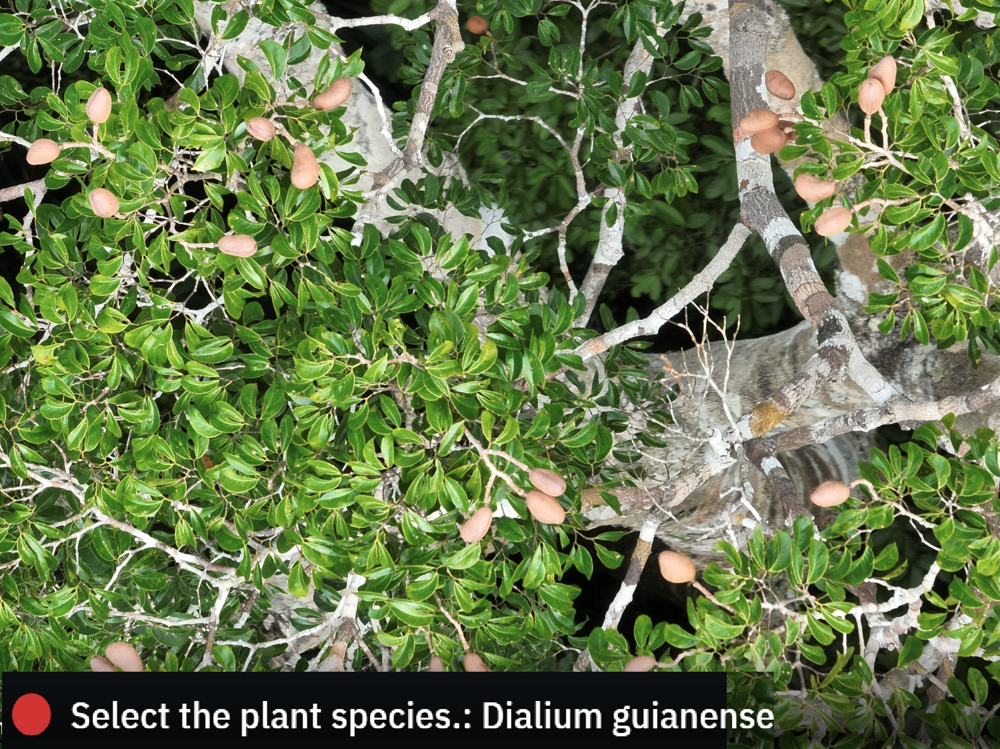
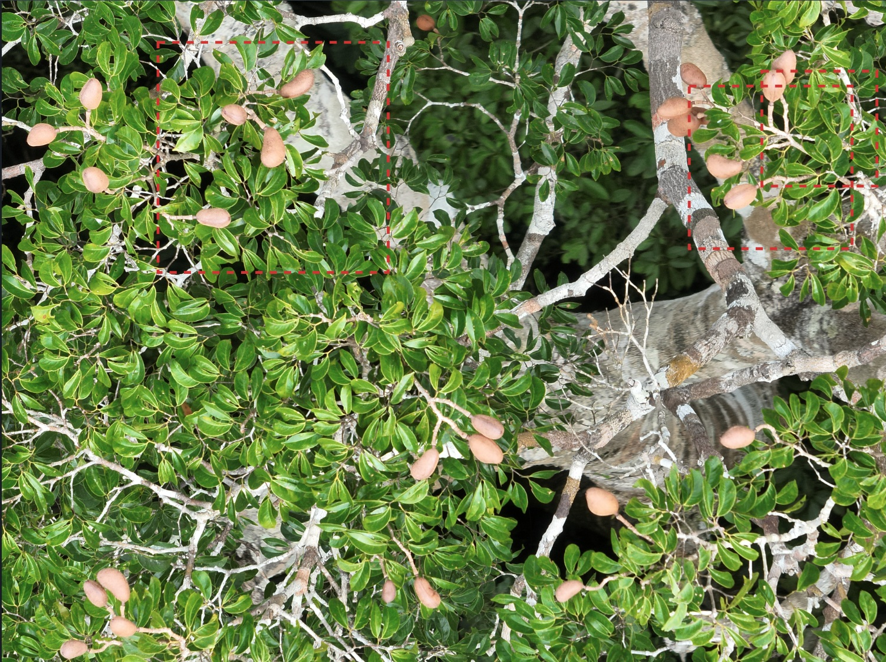
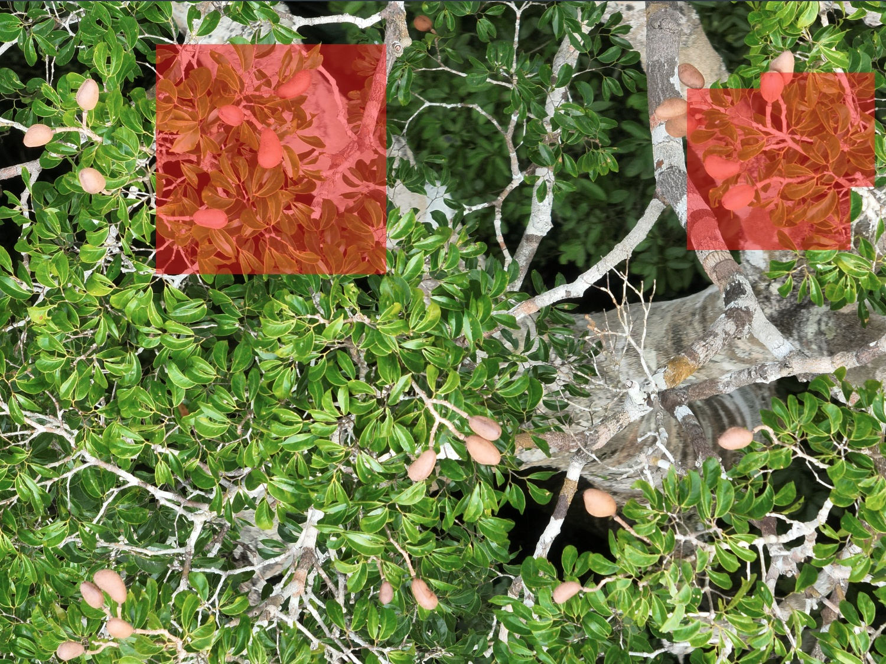

# 🌿 Labelbox × Pl\@ntNet — Brazilian Amazon Trees

<table>
  <tr>
    <th align="center">Classification</th>
    <th align="center">Boxes</th>
    <th align="center">Masks</th>
  </tr>
  <tr>
    <td align="center"></td>
    <td align="center"></td>
    <td align="center"></td>
  </tr>
</table>

Integrating [Pl\@ntNet](https://plantnet.org) multi-species predictions with [Labelbox](https://labelbox.com) for model-assisted labelling of ultra high-resolution drone close-up photos of tropical trees (Brazilian Amazon).

Three annotation workflows are demonstrated:

| Workflow | Annotation type | Active learning? | Script folder |
|:---|:---|:---|:---|
| 🎯 **Classification** | Global Radio | ✅ Yes (confidence works) | `scripts/04a_class/` |
| 📦 **Boxes** | `BBOX` + nested Radio | ✅ Yes (confidence works) | `scripts/04b_boxes/` |
| 🎭 **Masks** | `RASTER_SEGMENTATION` + nested Radio | ⚠️ Confidence stored but UI filter broken | `scripts/04c_masks/` |

Pl\@ntNet micro-project used: [Trees of the Brazilian Amazon](https://identify.plantnet.org/xprize-final-trees/species) (\~2 464 taxa).

------------------------------------------------------------------------

## 💻 Prerequisites

-   **Python 3.10+** (tested with 3.13)
-   **Git** installed ([git-scm.com](https://git-scm.com))
-   A **Pl\@ntNet API key** → [my.plantnet.org](https://my.plantnet.org)
-   A **Labelbox API key** → [app.labelbox.com](https://app.labelbox.com) → Settings → API Keys


------------------------------------------------------------------------

## ⚙️ Setup

### 1. Clone this repo

``` bash
git clone https://github.com/YOUR_USERNAME/labelbox_plantnet.git
cd labelbox_plantnet
```

### 2. Create a virtual environment

``` bash
python -m venv .venv
```

### 3. Activate the virtual environment

**Windows (PowerShell):**

``` powershell
.venv\Scripts\Activate.ps1
```

**Windows (CMD):**

``` cmd
.venv\Scripts\activate.bat
```

**macOS / Linux:**

``` bash
source .venv/bin/activate
```

### 4. Install dependencies

``` bash
pip install -r requirements.txt
```

### 5. Set up your API keys

Copy the example file:

``` bash
copy .env.example .env
```

Then open `.env` in a text editor and paste your real keys:

``` bash
PLANTNET_API_KEY=your-plantnet-api-key-here
LABELBOX_API_KEY=your-labelbox-api-key-here
```

> ⚠️ **Never commit `.env`** — it is already in `.gitignore`.

### 6. Add your drone images

Place your `.JPG` drone photos in the `images/` folder:

``` bash
images/
DJI_20250405090025_0008_V_121zoom.JPG
DJI_20250405090425_0018_V_93zoom.JPG
```


------------------------------------------------------------------------

## 🏃 How to run — step by step

All commands assume you are in the project root (`labelbox_plantnet/`) with the virtual environment activated.

The pipeline is split into **shared steps** (fetch species, upload images, get Pl\@ntNet predictions) followed by **workflow-specific steps** (classification, boxes, masks). The shared steps only need to be run once; the three workflows can then be run independently.

> ⚠️ All parameters are paths are configurable in `config.yaml`. The provided scripts use the default paths as shown in the outputs below.

### 🌱 Step 1 — Fetch species list from Pl\@ntNet

Downloads the \~2 464 species (scientific names + GBIF IDs) from the "Trees of the Brazilian Amazon" micro-project. This is a **shared** step — the species list is used by all three workflows.

```bash
python scripts/01_species/01_fetch_species.py
```

**Output**: `output/species/species_raw.json, output/species/species_list.csv`

### 🖼️ Step 2 — Upload images to Labelbox

Creates a Labelbox dataset and uploads all images from the images/ folder. This is a shared step — the same dataset is reused by all three workflows.

``` bash
python scripts/02_images/02_upload_images.py
```

**Output**: `output/images/dataset_id.txt, output/images/upload_summary.json`

### 🔮 Step 3 — Run Pl\@ntNet predictions

Two prediction scripts are available:

#### 3a. Single-species predictions (Classification workflow):

Runs the standard Pl\@ntNet identify endpoint on each image, returning the single best species prediction per image, with confidence score. This is used in the Classification workflow as a global image-level label.

``` bash
python scripts/03_predictions/03a_single_predict.py
```

**Output**: `output/predictions/single_predictions.json`

#### 3b. Multi-species survey predictions (Boxes and Masks workflows):

Runs the multi-species (i.e. survey) endpoint, which breaks each image into tiles and returns the best species prediction + confidence score for each tile. This is used in the Boxes and Masks workflows to create more granular annotations.

``` bash
`python scripts/03_predictions/03b_multi_predict.py`
```

**Output**: `output/predictions/multi_predictions.json`

> ⚠️ The multi-species survey endpoint can be expensive in API credits. The script displays a cost estimate before proceeding.

### 🎯 Step 4a — Classification workflow

Uses **single-species predictions** — each image gets a single global label with the top predicted species. This can be useful for active learning to prioritize human review of low-confidence images.

#### 4a.1 — Create the classification ontology

The classification ontology uses a single `Radio` tool with one class per species (2 464 classes in this example).

``` bash
python scripts/04a_class/04_create_ontology.py`
```

**Output:** `output/class/ontology_id.txt`

#### 4a.2 — Create the classification project

Creates an empty labelling classification project to classify individual imnages to its most likely species.

``` bash
python scripts/04a_class/05_create_project.py
```

**Output:** `output/class/project_id.txt`

#### 4a.3 — Import classification predictions into a Model Run

Imports the single-species Pl\@ntNet predictions as a Model Run in Labelbox, associating each image with its predicted species label and confidence score.

``` bash
python scripts/04a_class/06_import_predictions.py
```

> ⚠️ To send batchs to the labelling project, consult the [documentation](https://docs.labelbox.com/docs/model-run-batches).

**Output:** `output/class/model_run_id.txt`, `output/class/model_run_summary.json`

### 📦 Step 4b — Bounding box workflow

Uses **multi-species survey predictions** — each species tile becomes a bounding box with a nested species Radio classification.

#### 4b.1 — Create the bounding box ontology

The bounding box ontology uses a `BBOX` tool to delineate species in the image, with a nested `Radio` for species classification (2 464 classes in this example).

``` bash
python scripts/04b_boxes/04_create_ontology.py
```

**Output:** `output/boxes/ontology_id.txt`

#### 4b.2 — Create the bounding box project

Creates an empty labelling bounding box project to delineate species in the image.

``` bash
python scripts/04b_boxes/05_create_project.py
```

**Output:** `output/boxes/project_id.txt`

#### 4b.3 — Import box predictions into a Model Run

Imports the multi-species Pl\@ntNet predictions as a Model Run in Labelbox, selecting for each species predicted in an image the single tile with the highest confidence score.

``` bash
python scripts/04b_boxes/06_import_predictions.py
```

**Output:** `output/boxes/model_run_id.txt`, `output/boxes/model_run_summary.json`

### 🎭 Step 4c — Segmentation mask workflow

Uses **multi-species survey predictions** — each species' best tile is painted onto a composite mask image with a unique color per species. These are made from box predictions but overlapping regions keep only the species with the highest confidence.

#### 4c.1 — Create the segmentation ontology

The segmentation mask ontology uses a `RASTER_SEGMENTATION` tool with one class per species.

``` bash
python scripts/04c_masks/04_create_ontology.py
```

**Output:** `output/masks/ontology_id.txt`

#### 4c.2 — Create the segmentation project

Creates an empty labelling segmentation project to delineate species in the image with masks.

``` bash
python scripts/04c_masks/05_create_project.py
```

**Output:** `output/masks/project_id.txt`

#### 4c.3 — Import mask predictions into a Model Run

Imports the multi-species Pl\@ntNet predictions as a Model Run in Labelbox, creating composite mask images for each photo where each pixel is assigned to the species with the highest confidence prediction for that pixel's tile.

> ⚠️ Mask uploads are slow due to large PNG files (4000×3000 px). Expect a few minutes.

``` bash
python scripts/04c_masks/06_import_predictions.py
```

**Output:** `output/masks/model_run_id.txt`, `output/masks/model_run_summary.json`, `output/masks/composite_masks/*.png`

------------------------------------------------------------------------

## 🏗️ Project structure

```         
labelbox_plantnet/
├── .env.example              # Template for API keys
├── .env                      # Your actual API keys (git-ignored)
├── .gitignore
├── config.yaml               # Central pipeline configuration
├── requirements.txt
├── README.md
├── images/                   # Your drone photos (git-ignored)
│   └── *.JPG
├── media/                    # Screenshots for README
│   ├── class.jpg
│   ├── boxes.jpg
│   └── masks.jpg
├── scripts/
│   ├── 01_species/           # Shared: fetch species list
│   │   └── 01_fetch_species.py
│   ├── 02_images/            # Shared: upload images to Labelbox
│   │   └── 02_upload_images.py
│   ├── 03_predictions/       # Shared: run Pl@ntNet predictions
│   │   ├── 03a_single_predict.py
│   │   └── 03b_multi_predict.py
│   ├── 04a_class/            # Classification workflow
│   │   ├── 04_create_ontology.py
│   │   ├── 05_create_project.py
│   │   └── 06_import_predictions.py
│   ├── 04b_boxes/            # Bounding box workflow
│   │   ├── 04_create_ontology.py
│   │   ├── 05_create_project.py
│   │   └── 06_import_predictions.py
│   └── 04c_masks/            # Segmentation mask workflow
│       ├── 04_create_ontology.py
│       ├── 05_create_project.py
│       └── 06_import_predictions.py
└── output/                   # Generated files (git-ignored except .gitkeep)
    ├── species/              # species_raw.json, species_list.csv
    ├── images/               # dataset_id.txt, upload_summary.json
    ├── predictions/          # single_predictions.json, multi_predictions.json
    ├── class/                # ontology_id.txt, project_id.txt, model_run_id.txt
    ├── boxes/                # ontology_id.txt, project_id.txt, model_run_id.txt
    └── masks/                # ontology_id.txt, project_id.txt, model_run_id.txt, composite_masks/
```

------------------------------------------------------------------------

## 🚫 Known limitations

-   **Confidence threshold slider does not filter segmentation masks** in the Labelbox Model Run gallery view. Confidence scores are stored correctly in the nested classification (i.e. species predictions) but not at the tool (mask) level, such that the UI slider has no effect on mask predictions. This works correctly for bounding boxes and classification.

-   **Max 4 000 classes per ontology** — the 2 464 taxa from the Brazilian Amazon micro-project fits within this limit, but the full Pl\@ntNet global flora (82K species) would not.

------------------------------------------------------------------------

## 🔗 Useful links

-   [Pl\@ntNet API — Single species](https://my.plantnet.org/doc/api/identify)

-   [Pl\@ntNet API — Survey (multi-species)](https://my.plantnet.org/doc/api/survey)

-   [Labelbox — Image editor & ontology](https://docs.labelbox.com/docs/image-editor#set-up-an-ontology)

-   [Labelbox — Upload image predictions](https://docs.labelbox.com/reference/upload-image-predictions)

-   [Labelbox — Active learning](https://docs.labelbox.com/docs/active-learning)

-   [Labelbox — Limits (4K classes)](https://docs.labelbox.com/docs/limits)